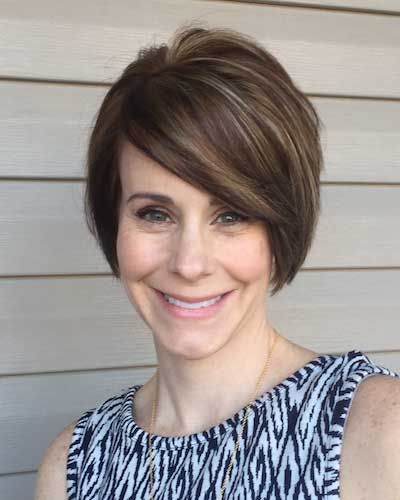
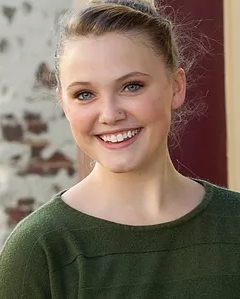
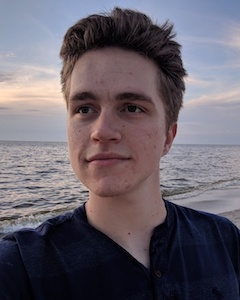

---
hide:
  - navigation
  - toc
---

# People

    
    

    <h2>Jeffrey D. Karpicke</h2>
    
Principal Investigator

    <a href="../downloads/Karpicke_Vita.pdf" rel="noreferrer" target="_blank">CV</a> •
    <a href="https://scholar.google.com/citations?user=5t5lgCgAAAAJ" rel="noreferrer" target="_blank">Google Scholar</a>
    
I'm interested in all things related to the science of learning, education, and technology. Currently, our lab is pursuing
    research projects in the following areas:
    <ul>
        <li>Retrieval processes and retrieval-based learning</li>
        <li>Development of computer-based learning tools</li>
        <li>Complex learning, comprehension, and knowledge application</li>
        <li>Learning and cognitive strategies in children</li>
        <li>Metacognition and self-regulated learning</li>
    </ul>

    

    
    

    <h2>Stephanie Karpicke</h2>
    
Research Coordinator

    
I am interested in how children learn and how we can apply research on learning strategies in school settings. In the Cognition and Learning Lab, I coordinate all school-based research with our collaborating schools, teachers, parents, and children. I also oversee all experiments we conduct in our collaborating schools.

    

    
    

    <h2>Michelle E. Coverdale</h2>
    
Postdoctoral Research Associate

    
I'm interested in the studying effects of choices on memory and in applying basic memory research to understaning and improving learning and memory in educational settings. 

    

    
    

    <h2>Breanne Kline</h2>
    
Research Technician

    
I am interested in how children learn and how we can apply research on learning strategies in school settings. In the Cognition and Learning Lab, I coordinate all school-based research with our collaborating schools, teachers, parents, and children. I also oversee all experiments we conduct in our collaborating schools.

    

    
    

    <h2>Andrew Arpasi</h2>
    
Developer

    
I am interested in how children learn and how we can apply research on learning strategies in school settings. In the Cognition and Learning Lab, I coordinate all school-based research with our collaborating schools, teachers, parents, and children. I also oversee all experiments we conduct in our collaborating schools.

    

    
    

    <h2>Vishnu Vijayan</h2>
    
Developer

    
I am interested in how children learn and how we can apply research on learning strategies in school settings. In the Cognition and Learning Lab, I coordinate all school-based research with our collaborating schools, teachers, parents, and children. I also oversee all experiments we conduct in our collaborating schools.

    

## Lab Alumni

[Caroline Byrd Hornburg](https://sites.google.com/view/caroline-byrd-hornburg){target="_blank" rel="noreferrer"} 
Assistant Professor 
Virginia Tech 
Postdoctoral Research Associate (2017-2019) 

[Robert Ariel](https://sites.google.com/view/robert-ariel){target="_blank" rel="noreferrer"} 
Assistant Professor 
Virginia Wesleyan University 
Postdoctoral Research Associate (2015-2018) 

[William Aue](https://www.linkedin.com/in/william-aue){target="_blank" rel="noreferrer"} 
Cognitive Neuroscientist 
Wright State Research Institute 
Postdoctoral Research Associate (2014-2018) 

**Joseph Bedwell** 
User Experience Researcher 
Amazon 
M.S. Student (2016-2018) 

**Ludmila Nunes** 
Science Writer 
Association for Psychological Science 
Postdoctoral Research Associate (2013-2016) 

[Joshua Whiffen](https://www.linkedin.com/in/joshua-whiffen-230618122){target="_blank" rel="noreferrer"} 
Research Associate 
Horizon Research, Inc. 
M.S. Student (2012-2016) 

[Janell Blunt](https://anderson.edu/humanities-behavioral-science/faculty/psychology/blunt){target="_blank" rel="noreferrer"} 
Assistant Professor 
Anderson University 
Ph.D. Student (2011-2015) 

[Megan Sumeracki](http://www.learningscientists.org/){target="_blank" rel="noreferrer"} 
Assistant Professor 
Rhode Island College 
Ph.D. Student (2011-2014) 

[Melissa Lehman](https://www.lynn.edu/campus-directory/melissa-lehman){target="_blank" rel="noreferrer"} 
Assistant Professor 
Lynn University 
Postdoctoral Research Associate (2011-2014) 

[Phillip Grimaldi](http://www.phillipgrimaldi.com/){target="_blank" rel="noreferrer"} 
Director of Research 
OpenStax College and Rice University 
Ph.D. Student (2008-2014) 

[Althea Kaminske](https://www.sbu.edu/academics/psychology/faculty-and-staff/bauernschmidt-althea){target="_blank" rel="noreferrer"} 
Assistant Professor 
St. Bonaventure University 
Ph.D. Student (2008-2013) 
 
