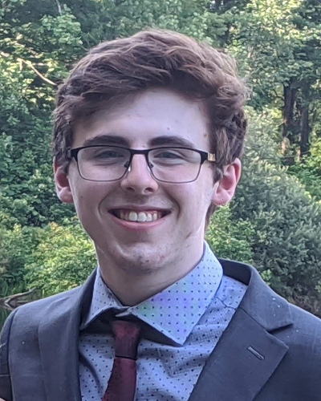

---
hide:
  - navigation
  - toc
  - footerNavigation
  - handbookNav
---

# People

    
    

    <h2>Jeffrey D. Karpicke</h2>
    <h4>Principal Investigator</h4>
    <a href="downloads/Karpicke_Vita.pdf" rel="noreferrer" target="_blank">CV</a> •
    <a href="https://scholar.google.com/citations?user=5t5lgCgAAAAJ" rel="noreferrer" target="_blank">Google Scholar</a>
    
I'm interested in all things related to the science of learning, education, and technology. Currently, our lab is pursuing
    research projects in the following areas:
    <ul>
        <li>Retrieval processes and retrieval-based learning</li>
        <li>Development of computer-based learning tools</li>
        <li>Complex learning, comprehension, and knowledge application</li>
        <li>Learning and cognitive strategies in children</li>
        <li>Metacognition and self-regulated learning</li>
    </ul>

    

    
    

    <h2>Michelle E. Coverdale</h2>
    <h4>Postdoctoral Research Associate</h4>
    
I'm interested in the studying effects of choices on memory and in applying basic memory research to understaning and improving learning and memory in educational settings. 

    

    
    

    <h2>Jiaan Shang</h2>
    <h4>Graduate Student</h4>
    
My research interest focuses on applying cognitive psychology to teaching and learning. More specifically, I’m interested in the effects of different learning strategies and criterion tasks on memory, mind-wandering and metacognition. Although my past research experience has been mainly in the field of reading comprehension, I’m interested in learning using a variety of materials and tasks. 

    

    
    

    <h2>Kyle Zheng</h2>
    <h4>Programmer</h4>
    <a href="https://kylezhe.ng" rel="noreferrer" target="_blank">Website</a>
    
I help researchers program online experiments and maintain the relevant websites and software. As an undergraduate computer science student, my interests lie in creating tools to enhance the pursuit of art/science.

    

    
    

    <h2>Ryan Leonard</h2>
    <h4>Programmer</h4>
    
I am an undergraducate Computer Science student interested in learning new ways to build online tools that make people's lives easier. 
    I will be working with the reseach team by helping build experiments and performing maintenence tasks.

    

## Lab Alumni

[Garrett O'Day](https://www.linkedin.com/in/garrett-oday/){target="\_blank" rel="noreferrer"} 
Senior Manager, Research  
Active Minds  
Ph.D. Student (2016-2022) 

[Amedee Martella](https://mayerlab.psych.ucsb.edu/people/amedee-martella){target="\_blank" rel="noreferrer"} 
National Science Foundation Postdoctoral Research Fellow 
University of California, Santa Barbra 
Ph.D. Student (2019-2022) 

[Caroline Byrd Hornburg](https://sites.google.com/view/caroline-byrd-hornburg){target="\_blank" rel="noreferrer"} 
Assistant Professor 
Virginia Tech 
Postdoctoral Research Associate (2017-2019) 

[Robert Ariel](https://sites.google.com/view/robert-ariel){target="\_blank" rel="noreferrer"} 
Assistant Professor 
Virginia Wesleyan University 
Postdoctoral Research Associate (2015-2018) 

[William Aue](https://www.linkedin.com/in/william-aue){target="\_blank" rel="noreferrer"} 
Research Psychologist 
Air Force Research Laboratory 
Postdoctoral Research Associate (2014-2018) 

**Joseph Bedwell** 
User Experience Researcher 
Indeed.com 
M.S. Student (2016-2018) 

**Ludmila Nunes** 
Science Writer 
Association for Psychological Science 
Postdoctoral Research Associate (2013-2016) 

[Joshua Whiffen](https://www.linkedin.com/in/joshua-whiffen-230618122){target="\_blank" rel="noreferrer"} 
Data Analytics and Engineering 
Credit Suisse 
M.S. Student (2012-2016) 

[Janell Blunt](https://anderson.edu/staff/dr-janell-blunt/){target="\_blank" rel="noreferrer"} 
Assistant Professor 
Anderson University 
Ph.D. Student (2011-2015) 

[Megan Sumeracki](https://www.ric.edu/people-directory/megan-sumeracki){target="\_blank" rel="noreferrer"} 
Associate Professor 
Rhode Island College 
Ph.D. Student (2011-2014) 

[Melissa Lehman](https://www.lynn.edu/campus-directory/melissa-lehman){target="\_blank" rel="noreferrer"} 
Associate Professor 
Lynn University 
Postdoctoral Research Associate (2011-2014) 

[Phillip Grimaldi](http://www.phillipgrimaldi.com/){target="\_blank" rel="noreferrer"} 
Senior Efficacy and Research Scientist 
Khan Academy 
Ph.D. Student (2008-2014) 

[Althea Kaminske](https://www.sbu.edu/academics/faculty/kaminske-althea-need){target="\_blank" rel="noreferrer"} 
Associate Professor 
St. Bonaventure University 
Ph.D. Student (2008-2013) 
 
